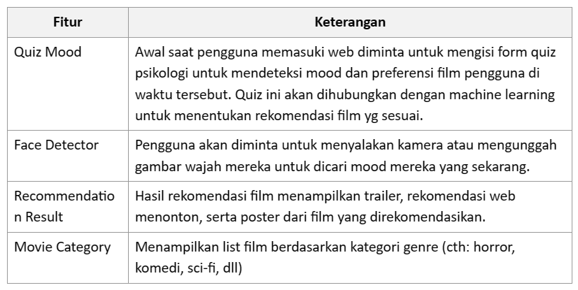
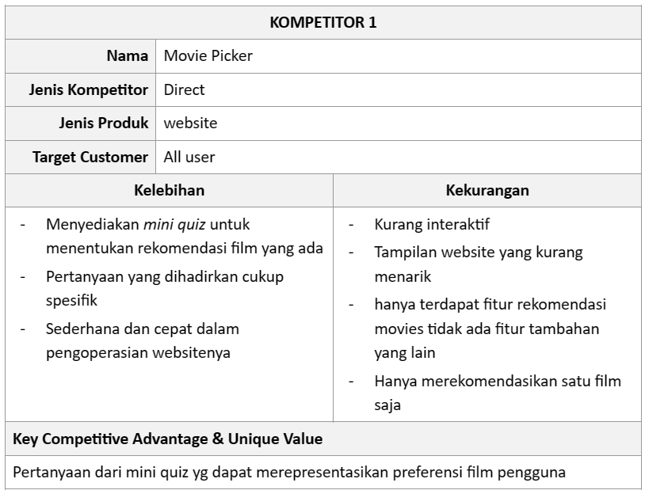
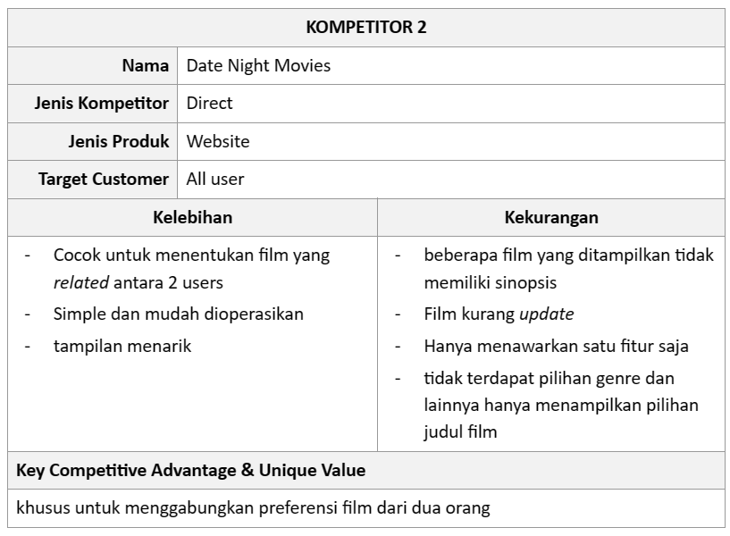
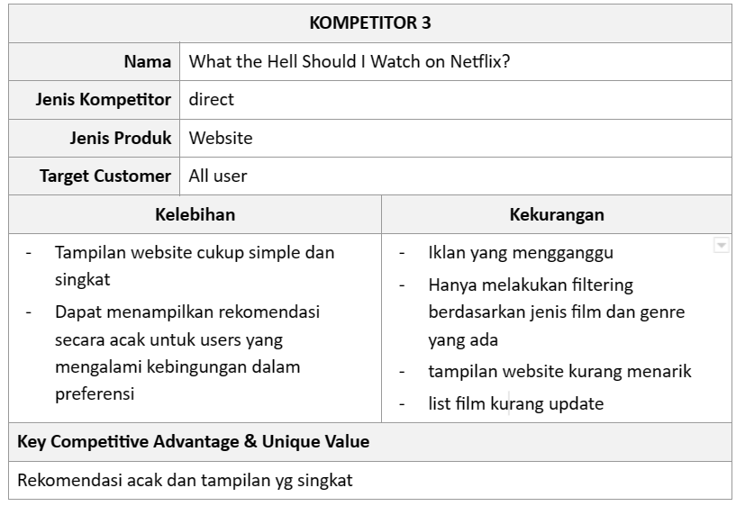

<h2 align="center">
  🎬 MovieAI - Find your match movie with AI
</h2>

Web App | Senior Project TIF 2023 

Departemen  Teknologi  Elektro  dan  Teknologi  Informasi,  Fakultas  Teknik, 
Universitas Gadjah Mada 

## 👥 Dindas's Gang

- [Evan Ananda Jati (20/460543/TK/51132)](https://github.com/evanjat2)
- [Adinda Luthfiah Sya’bani (20/463587/TK/51579)](https://github.com/adindaluthfiah)
- [Rizky Intan Nurlita (20/456379/TK/50509)](https://www.github.com/rizkyintan)
- [Dinda Sabela Rahma Wisista (20/463598/TK/51590)](https://www.github.com/dindasabela)

## ❓ Tentang Aplikasi

MovieAI adalah aplikasi berbasis web yang membantu pengguna mencari film yang sesuai preferensi mereka berdasarkan kondisi mood mereka yang mana dapat diketahui dari pengisian mini form dan raut muka yang diambil di awal saat memasuki web. MovieAI akan merekomendasikan beberapa film berdasarkan hasil pemrosesan AI.

## Latar Belakang 
Belakangan ini menonton film menjadi salah satu kegiatan yang paling diminati. Selainkarena mudah diakses di internet, film juga dapat menjadi sarana relaksasi danme time.

Permasalahan yang seringkali dijumpai adalah pengguna kebingungan memilih genre film yang akan ditonton sehingga mencari berbagai rekomendasi judul film.Untuk memudahkan dan membantu pemilihan judul, kami membuat suatu aplikasiberbasis AI  untuk merekomendasikan beberapa film sesuai dengan kondisi emosi ataumood pengguna saat itu.

## Rumusan Permasalahan
Apa yang dapat ditonton seseorang ketika berada dalam mood tertentu?
Seberapa berpengaruh hasil mini quiz yang kami sediakan terhadap hasil rekomendasi film yang muncul?
Apakah ekspresi seseorang berpengaruh terhadap mood user?
## Fungsi Aplikasi

Merekomendasikan berbagai judul film berdasarkan kondisi emosi atau mood dari pengguna. Nantinya, pengguna akan diminta untuk mengisi beberapa pertanyaan yang disediakan dan apabila berkenan dapat memanfaatkan fitur Face Detector yang tersedia untuk menngkatkan akurasi identifikasi mood sehingga output yang keluar dapat sesuai dengan preferensi mood pengguna.

## Ide Solusi
Akan terdapat face recognition beserta beberapa kuis untuk menentukan rekomendasi film yang dapat ditonton.

## Analisis Kompetitor

